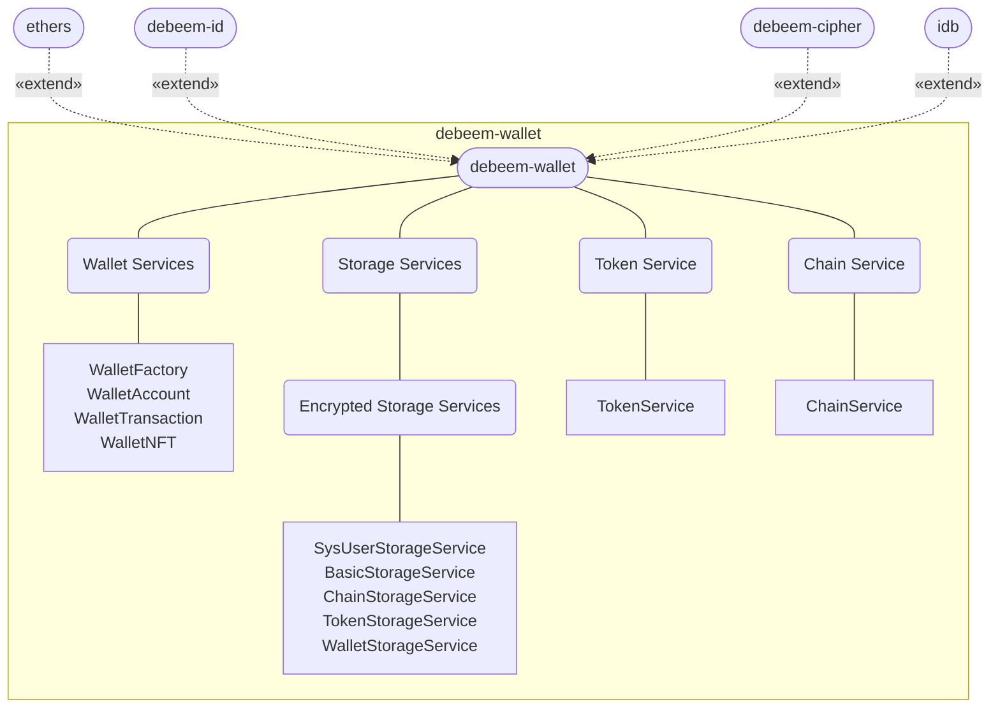

# debeem-wallet

A complete, compact, and simple Ethereum wallet library based on the ethers library.

## Table of contents
- [Features](#Features)
- [Architecture](#Architecture)
- [Installation](#Installation)
- [Usage](#Usage)
  - [Configuration](#Configuration)
  - [Getting started](#Getting started)


## Features

1. Easy to use, whether you have experience in Ethereum wallet development or not, you can easily get started.
1. Provides complete functions such as creation, import, and backup of Ethereum wallets.
1. Provides balance query, total value statistics, and real-time trading pair quotes for Ethereum native token and derivative tokens.
1. Provides transfer, real-time transaction gas fee estimating, transaction history query, transaction details query, and transaction receipt query functions for Ethereum native token and derivative tokens.
1. Provides information query for Ethereum native token and derivative tokens.
1. Provides network information query by chainId.
1. Provide local structured data storage based on AES256 encryption algorithm, and the password can be modified at will.


## Architecture



## Installation
```
npm i debeem-wallet
```

## Usage
### Configuration
Get, set, and reset the current network configuration.

| Function                                                 | Description                                   |
|----------------------------------------------------------|-----------------------------------------------|
| [getDefaultChain](config.md#getDefaultChain())           | get default chainId                           |
| [getCurrentChain](config.md#getCurrentChain())           | get current chainId                           |
| [setCurrentChain](config.md#setCurrentChain())           | set/update current chainId                    |
| [revertToDefaultChain](config.md#revertToDefaultChain()) | revert the current chain to the default chain |


### Getting started

#### Wallet Services
  - WalletFactory
  - WalletAccount
  - WalletTransaction
  - WalletNFT

#### Storage Services
  - SysUserStorageService
  - BasicStorageService
  - ChainStorageService
  - TokenStorageService
  - WalletStorageService

#### Chain Service
  - ChainService

#### Token Service
  - TokenService


# API


# Unit Test

```
npm test
```
Or

```bash
npm install -g jest

jest
```
