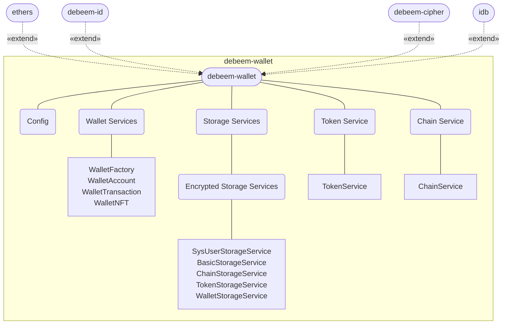

# debeem-wallet

A complete, compact, and simple Ethereum wallet library based on the ethers library.

## Table of contents
- [Features](#Features)
- [Architecture](#Architecture)
- [Installation](#Installation)
- [Configuration](#Configuration)
  - [About chain](#about-chain) 
  - [Configure a chain for your wallet](#configure-a-chain-for-your-wallet) 
- [Usage](#Usage)
  - [Wallet Services](#wallet-services)
  - [Storage Services](#storage-services)
  - [Chain Service](#chain-service)
  - [Token Service](#token-service)
- [Unit Tests](#unit-tests)
- [Documentation](#documentation)
  - [API Docs](#api-docs) 
- [License](#license)


## Features

1. Easy to use, whether you have experience in Ethereum wallet development or not, you can easily get started.
1. Provides complete functions such as creation, import, and backup of Ethereum wallets.
1. Provides balance query, total value statistics, and real-time trading pair quotes for Ethereum native token and derivative tokens.
1. Provides transfer, real-time transaction gas fee estimating, transaction history query, transaction details query, and transaction receipt query functions for Ethereum native token and derivative tokens.
1. Provides information query for Ethereum native token and derivative tokens.
1. Provides network information query by chainId.
1. Provide local structured data storage based on AES256 encryption algorithm, and the password can be modified at will.


## Architecture
### UML Graph


### Dependency Packages

- [debeem-id](https://www.npmjs.com/package/debeem-id)
- [debeem-cipher](https://www.npmjs.com/package/debeem-cipher)
- [ethers](https://www.npmjs.com/package/ethers)
- [idb](https://www.npmjs.com/package/idb)


## Installation
### 1, install nvm
use the following cURL or Wget command to install [nvm](https://github.com/nvm-sh/nvm?tab=readme-ov-file):
```shell
curl -o- https://raw.githubusercontent.com/nvm-sh/nvm/v0.39.7/install.sh | bash
```
```shell
wget -qO- https://raw.githubusercontent.com/nvm-sh/nvm/v0.39.7/install.sh | bash
```
### 2, install node

install the latest LTS version of node, for example: v18.20.3 (Latest LTS: Hydrogen)
```shell
nvm install v18.20.3
nvm use v18.20.3
```
### 3, install our package
```shell
npm i debeem-wallet
```
*to fix issue: `Module not found: Error: Can't resolve 'fake-indexeddb/auto'`*
```shell
npm i -D fake-indexeddb
```

## Configuration

### About chain
There are many chains in the entire blockchain world, such as the Bitcoin chain, Ethereum chain, etc. Every wallet **MUST** work on a certain chain (or call it a network).

So, before using any functions or classes in this development package, you **MUST** first configure a chain/network for your wallet.

View all chains on:  
https://chainlist.org/


### Configure a chain for your wallet

| Function                                                                                                                    | Description                                   |
|-----------------------------------------------------------------------------------------------------------------------------|-----------------------------------------------|
| [getDefaultChain](https://debeem.github.io/docs/js-debeem-wallet/functions/config_functions.getDefaultChain.html)           | get default chainId                           |
| [getCurrentChain](https://debeem.github.io/docs/js-debeem-wallet/functions/config_functions.getCurrentChain.html)           | get current chainId                           |
| [setCurrentChain](https://debeem.github.io/docs/js-debeem-wallet/functions/config_functions.setCurrentChain.html)           | set/update current chainId                    |
| [revertToDefaultChain](https://debeem.github.io/docs/js-debeem-wallet/functions/config_functions.revertToDefaultChain.html) | revert the current chain to the default chain |


## Usage

### Wallet Services

| Class                                                                                              | Description                                                                                                                                            |
|----------------------------------------------------------------------------------------------------|--------------------------------------------------------------------------------------------------------------------------------------------------------|
| [WalletFactory](https://debeem.github.io/docs/js-debeem-wallet/modules/WalletFactory.html)         | create a new wallet, or import a wallet from a mnemonic, keystore, private key or a wallet address                                                     |
| [WalletAccount](https://debeem.github.io/docs/js-debeem-wallet/modules/WalletAccount.html)         | query balance, calculate total value, and request quotes in real-time for the Ethereum native token or any derivative tokens                           |
| [WalletTransaction](https://debeem.github.io/docs/js-debeem-wallet/modules/WalletTransaction.html) | send and receive your Ethereum native token or any derivative tokens, estimate transaction gas fee, and query transaction history, details and receipt |
| [WalletNFT](https://debeem.github.io/docs/js-debeem-wallet/modules/WalletNFT.html)                 | query NFTs information                                                                                                                                 |


### Storage Services

| Class                                                                                                      | Description                                                                                                               |
|------------------------------------------------------------------------------------------------------------|---------------------------------------------------------------------------------------------------------------------------|
| [SysUserStorageService](https://debeem.github.io/docs/js-debeem-wallet/modules/SysUserStorageService.html) | manage encryption information table and modify PIN code                                                                   |
| [BasicStorageService](https://debeem.github.io/docs/js-debeem-wallet/modules/BasicStorageService.html)     | simple storage based on key-value                                                                                         |
| [ChainStorageService](https://debeem.github.io/docs/js-debeem-wallet/modules/ChainStorageService.html)     | get the default supported chain list, get information of a chain, add, delete and update the information of a chain |
| [TokenStorageService](https://debeem.github.io/docs/js-debeem-wallet/modules/TokenStorageService.html)     | manage tokens of a wallet on a specified chain. get the token list, add, delete and update the token information |
| [WalletStorageService](https://debeem.github.io/docs/js-debeem-wallet/modules/WalletStorageService.html)   | based on secure encryption, obtain information of a wallet, add, delete and update a wallet                      |


### Chain Service

| Class                                          | Description                                                                |
|------------------------------------------------|----------------------------------------------------------------------------|
| [ChainService](https://debeem.github.io/docs/js-debeem-wallet/modules/ChainService.html) | check whether a chain exists and obtain the chain information by chain id. |


### Token Service

| Class                                                                                    | Description                                                                        |
|------------------------------------------------------------------------------------------|------------------------------------------------------------------------------------|
| [TokenService](https://debeem.github.io/docs/js-debeem-wallet/modules/TokenService.html) | check whether a token exists and obtain the token information by contract address. |


## Unit Tests
This project has complete unit tests with an average coverage of over 90%. Run the unit tests in the project root directory:
```shell
jest
```


## Documentation
### API Docs
- [https://debeem.github.io/docs/js-debeem-wallet/](https://debeem.github.io/docs/js-debeem-wallet/)


## License
- MIT ([LICENSE-MIT](https://github.com/libp2p/js-libp2p/blob/main/LICENSE-MIT) / <http://opensource.org/licenses/MIT>)


