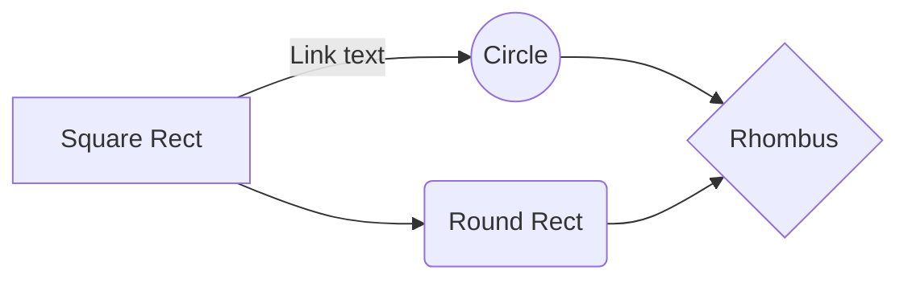

# debeem-wallet

A complete, compact, and simple Ethereum wallet library based on the ethers library.

### Features

1. Whether you have experience in Ethereum wallet development or not, you can easily get started.
1. Provides complete functions such as creation, import, and backup of Ethereum wallets.
1. Provides balance query, total value statistics, and real-time trading pair quotes for Ethereum native token and derivative tokens.
1. Provides transfer, real-time gas fee evaluation, transaction history query, transaction details query, and transaction receipt query functions for Ethereum native token and derivative tokens.
1. Provides information query for Ethereum native token and derivative tokens.
1. Provides network information query by chainId.
1. Provide local structured data storage based on AES256 encryption algorithm, and the password can be modified at will.


### Architecture




1. [Unit Test](#unit-test)

# Installation
```
npm install debeem-wallet
```

# Changes

[See details of (potentially) breaking changes](CHANGELOG.md).

# API

# Unit Test

```
npm test
```
Or

```bash
npm install -g jest

jest
```

## API Index

### Data Models

| Module | Description |
| :------ | :------ |
| [models/CallbackSetDesc](models/CallbackSetDesc.md) | - |
| [models/EthersNetworkProvider](models/EthersNetworkProvider.md) | - |
| [models/TokenModels](models/TokenModels.md) | - |
| [models/Transaction](models/Transaction.md) | - |
| [models/UsdtABIItem](models/UsdtABIItem.md) | - |

### Other

| Module | Description |
| :------ | :------ |
| [entities/ChainEntity](entities/ChainEntity.md) | - |
| [entities/StorageEntity](entities/StorageEntity.md) | - |
| [entities/SysUserEntity](entities/SysUserEntity.md) | - |
| [entities/TokenEntity](entities/TokenEntity.md) | - |
| [entities/WalletEntity](entities/WalletEntity.md) | - |
| [services/chain/ChainService](services/chain/ChainService.md) | - |
| [services/storage/AbstractStorageService](services/storage/AbstractStorageService.md) | - |
| [services/storage/BasicStorageService](services/storage/BasicStorageService/README.md) | - |
| [services/storage/ChainStorageService](services/storage/ChainStorageService.md) | - |
| [services/storage/IStorageService](services/storage/IStorageService.md) | - |
| [services/storage/SysUserStorageService](services/storage/SysUserStorageService.md) | - |
| [services/storage/TokenStorageService](services/storage/TokenStorageService.md) | - |
| [services/storage/WalletStorageService](services/storage/WalletStorageService.md) | - |
| [services/token/TokenService](services/token/TokenService.md) | - |
| [services/wallet/WalletAccount](services/wallet/WalletAccount.md) | - |
| [services/wallet/WalletFactory](services/wallet/WalletFactory.md) | - |
| [services/wallet/WalletNFT](services/wallet/WalletNFT.md) | - |
| [services/wallet/WalletTransaction](services/wallet/WalletTransaction.md) | - |
